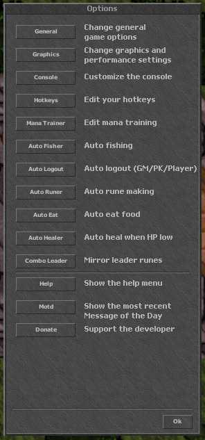
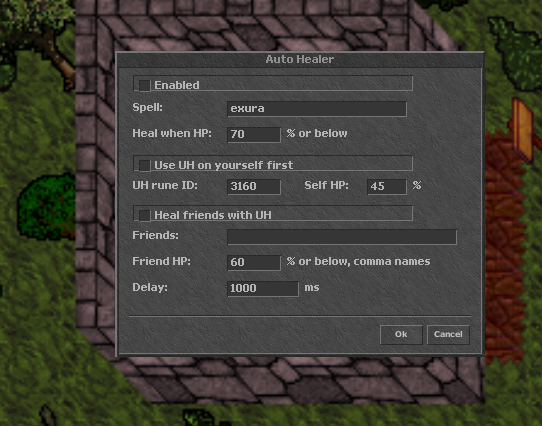
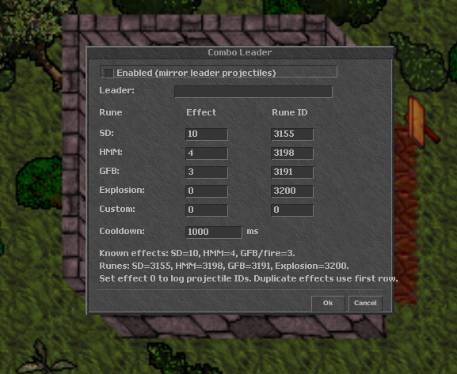
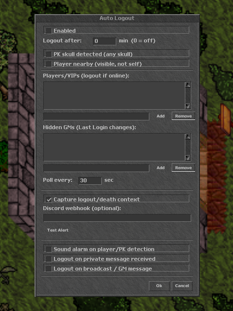
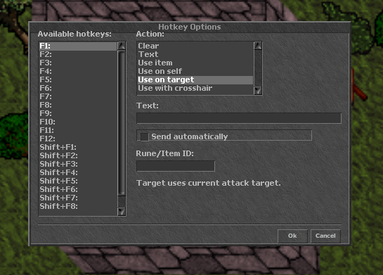
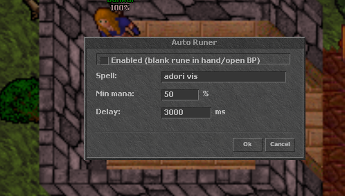

# Fibula Project Client

A custom **Tibia 7.72** client made for the **Project Fibula** server (`world.fibula.app`).
Written in C++ with SDL2. Open source. If you just want to play, download it and double-click — that's it.

> 🌎 *Versión en español: [README.md](README.md)*

> This client is built **specifically for Project Fibula**. It uses that server's own
> sprites and data, so it's not meant to connect to other servers.

---

## 🎮 Play (plug and play)

1. Go to the **[Releases](../../releases)** tab of this repo.
2. Download `Fibula-Client.zip`.
3. Unzip it anywhere (Desktop, a folder, wherever).
4. Open the folder and run **`FibulaClient.exe`**.
5. Type your **account** and **password**, and play.

No need to set up IPs or ports: the client already points to the Fibula server. If you
don't have an account yet, make one on the Project Fibula server.

> **Windows only (64-bit).** If Windows SmartScreen warns about an unknown publisher,
> click *More info → Run anyway* (it happens because the `.exe` isn't signed — normal for
> small projects).

### What's in the folder?
- `FibulaClient.exe` — the game.
- `Assets/` — sprites and graphics data (Tibia.spr, Tibia.dat, etc.).
- `.map` files — the minimap, pre-loaded so it shows from the first launch.
- `Tibia.cfg` — default config.
- `zlib1.dll`, `winmm.dll` — libraries the `.exe` needs.

Keep all of those files **together in the same folder**. If you separate the `.exe` from
the rest, it won't work.

---

## ✨ What's special

On top of the classic 7.72 client, it ships several assistants (each with a `Ctrl+Alt+key` shortcut):

- **Mana Trainer** (`Ctrl+Alt+M`) — casts a spell on its own once you have enough mana.
- **Auto Healer** (`Ctrl+Alt+H`) — heals you when your HP drops below a set %.
- **Auto Eat** (`Ctrl+Alt+E`) — eats food from your backpacks automatically.
- **Auto Fisher** (`Ctrl+Alt+F`) — fishes on the water next to you.
- **Auto Runer** (`Ctrl+Alt+R`) — makes runes when you have spare mana.
- **Auto Logout** (`Ctrl+Alt+L`) — logs you out if a GM shows up, a player gets close, you get PK'd, or after a timer.
- **Combo Leader** (`Ctrl+Alt+C`) — mirrors the combo leader's runes.
- **WASD movement** — W/A/S/D to move, Q/E/Z/C for diagonals, `Ctrl+WASD` to turn.
- **36 hotkeys** — F1-F12, Shift+F1-F12 and Ctrl+F1-F12.
- **Right-click to stack gold** — right-click gold/platinum/crystal to send it to your backpack or open bag.

You configure all of this from the **Options** menu in-game.

> 📖 **How does each one work?** There's a full tutorial with screenshots in
> **[TUTORIAL.en.md](TUTORIAL.en.md)**.

---

## 📸 Screenshots

<p align="center">
  
  
  
</p>
<p align="center">
  
  
  
</p>

More screenshots and the explanation of each assistant in **[TUTORIAL.en.md](TUTORIAL.en.md)**.

---

## 🛠️ Build it yourself (for forkers)

The full source code is in the [`source/`](source/) folder.

### Windows (Visual Studio 2022)
```powershell
MSBuild source\src\visual-studio\visual-studio.sln /p:Configuration=Release /p:Platform=x64
```
You need the *Visual Studio 2022 Build Tools* with the C++ toolset. Dependencies (SDL2,
libcurl) are already bundled inside `source/src/visual-studio/`.

### Linux (CMake)
```bash
cd source
cmake -B build -DCMAKE_BUILD_TYPE=Release
cmake --build build -j$(nproc)
```

---

## 📜 License and credits

This project is a **fork** of **The Forgotten Client** by *Saiyans King*, released under
the **zlib license**. The original copyright notices are kept in the code, as that license
requires.

Fibula Project Client's changes are released under the same zlib license. See
[`COPYING.txt`](COPYING.txt).

Tibia's sprites and graphics data are property of **CipSoft GmbH** and are included only
so you can play on Project Fibula.
