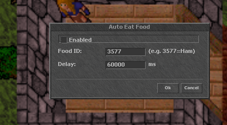

# 📖 Tutorial — Cómo funcionan las funcionalidades

Guía rápida de todo lo que trae el cliente. Cada asistente vive en el menú
**Options** y se enciende/apaga con su propia ventana. Todos comparten la misma
idea: lo configuras una vez, marcas **Enabled** y el cliente se encarga del resto.

> 💡 **Atajos.** Cada asistente tiene un `Ctrl+Alt+letra` para abrir su ventana al
> vuelo sin pasar por el menú. Al entrar al juego, el cliente te recuerda la lista
> en el Server Log.

---

## 🗂️ El menú Options

Todo arranca aquí. Botón derecho en el panel inferior → **Options**, o el botón de
opciones de la interfaz.

  

| Botón | Para qué sirve |
|---|---|
| **General** | Opciones de juego (control clásico, marcas, frames PvP, sidebars…) |
| **Graphics** | Rendimiento y calidad gráfica |
| **Console** | Personalizar la consola/chat |
| **Hotkeys** | Editar tus 36 atajos de objetos/hechizos |
| **Mana Trainer** | Entrenar magic level lanzando hechizos solo |
| **Auto Fisher** | Pescar automáticamente |
| **Auto Logout** | Desloguear solo (GM/PK/jugador cerca) |
| **Auto Runer** | Hacer runas automáticamente |
| **Auto Eat** | Comer comida automáticamente |
| **Auto Healer** | Curarte (y a tus amigos) automáticamente |
| **Combo Leader** | Espejear las runas del líder del combo |

---

## ⌨️ Hotkeys — tus atajos de objetos

  

36 slots configurables (`F1–F12`, `Shift+F1–F12`, `Ctrl+F1–F12`). Para cada uno
eliges una **acción**:

- **Clear** — vaciar el slot.
- **Text** — escribir/decir un texto fijo (ej. un hechizo `exura`).
- **Use on self** — usar el objeto sobre ti mismo (ej. una rune de cura).
- **Use on target** — usar el objeto sobre tu objetivo actual.
- **Use with crosshair** — usar con la cruceta para elegir destino con el mouse.

Marca **Send automatically** para que el texto se mande solo, y rellena el
**Rune/Item ID** cuando la acción usa un objeto.

> 🎮 **Movimiento WASD.** Además de las flechas, puedes moverte con `W/A/S/D`.

---

## 💧 Mana Trainer

Lanza un hechizo de ataque sin objetivo (o el que configures) en automático para
subir tu **magic level** mientras estás AFK en zona segura. Lo enciendes, pones el
hechizo y el delay, y a entrenar.

**Atajo:** `Ctrl+Alt+M`

---

## 🩹 Auto Healer

  

Te mantiene vivo solo. Configura:

- **Spell** — el hechizo de cura (ej. `exura`) y **Heal when HP** el porcentaje a
  partir del cual lo lanza.
- **Use UH rune on yourself first** — si lo marcas, prioriza una rune (Ultimate
  Healing) por encima del hechizo cuando tu vida cae a **Self HP %**. Indica el
  **UH rune ID** (ej. `3160`).
- **Heal friends with UH** — además, cura a los amigos de la lista (separados por
  coma) cuando su vida baja del **Friend HP %**.
- **Delay** — cada cuántos ms revisa.

**Atajo:** `Ctrl+Alt+H`

---

## 🔮 Auto Runer

  

Hace runas solo. Necesitas una **blank rune en la mano o una BP de blanks abierta**.
Configura el **Spell** (ej. `adori vis`), el **Min mana %** mínimo para castear y el
**Delay** entre runas.

**Atajo:** `Ctrl+Alt+R`

---

## 🍖 Auto Eat

  

Come solo cada cierto tiempo para no perder regeneración. Pon el **Food ID**
(ej. `3577` = Ham) y el **Delay** (ej. 60000 ms = cada minuto).

**Atajo:** `Ctrl+Alt+E`

---

## 🎣 Auto Fisher

Pesca automáticamente sobre tiles de agua con peces. Enciéndelo teniendo la caña de
pescar y déjalo correr.

**Atajo:** `Ctrl+Alt+F`

---

## 🚪 Auto Logout

  

El asistente de seguridad. Te saca del juego según las condiciones que elijas:

- **Logout after X min** — logout por inactividad (0 = apagado).
- **PK skull detected** — si aparece alguien con skull.
- **Player nearby** — si aparece cualquier jugador visible (no tú).
- **Players/VIPs** — logout si alguien de tu lista se conecta.
- **Hidden GMs** — detecta GMs ocultos por cambios de "last login".
- **Poll every X sec** — cada cuánto revisa.
- **Discord webhook** — manda una alerta a Discord (con botón **Test Alert**).
- Extras: **alarma sonora**, logout por **mensaje privado** o por **broadcast/GM**.

**Atajo:** `Ctrl+Alt+L`

---

## 🤝 Combo Leader

  

Para PvP en equipo: **espejea las runas del líder**. Cuando el líder lanza una runa
sobre un objetivo, tú lanzas la equivalente al mismo blanco al instante.

- **Leader** — nombre del líder a seguir.
- Tabla **Rune / Effect / Rune ID** — asocia cada efecto con tu rune:
  - SD → effect `10`, rune `3155`
  - HMM → effect `4`, rune `3198`
  - GFB → effect `3`, rune `3191`
  - Explosion → effect `0`, rune `3200`
  - Custom → el que quieras
- **Cooldown** — ms mínimos entre disparos.

> 🔎 Pon un effect en `0` para que el cliente te loguee el ID del proyectil y así
> descubrir efectos nuevos.

**Atajo:** `Ctrl+Alt+C`

---

## 🗺️ Minimapa

El minimapa viene **precargado** con el mapa del servidor, así que se ve desde el
primer arranque (no sale en negro). Lo que vayas explorando se guarda solo, junto al
`.exe`.

---

## 💰 Detalle cómodo

- **Apilar oro con click derecho** — click derecho sobre el oro lo manda directo a tu
  backpack/bag.

---

¿Algo no funciona como esperabas? Abre un *issue* en el repo. 🐛
